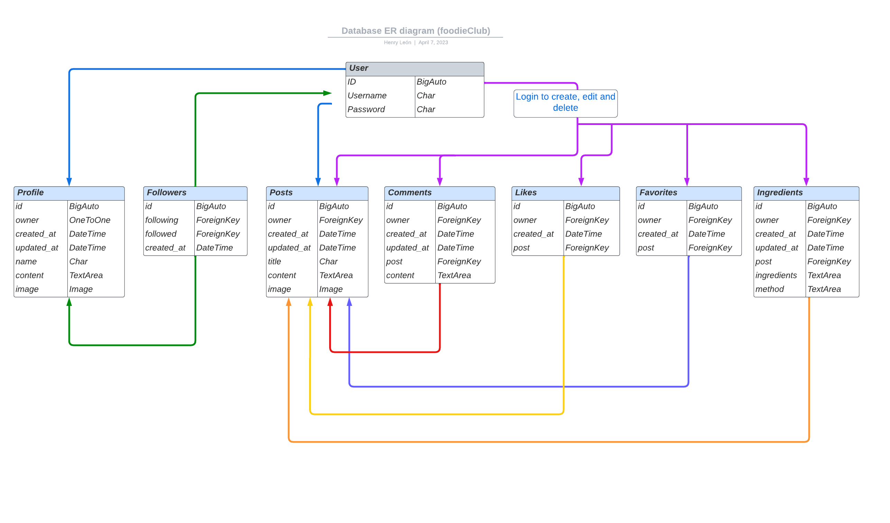

# foodieClub DRF-API - Backend

foodieClub project portfolio has been created for educational purposes only as the 5th project in the Code Institute’s full stack development program.

Using the principles of UX design and the agile development methodology, this project was developed using Django Rest Framework that handles all backend functionality including user profiles, posts, comments, likes, bookmark posts, add recipes to posts, followers, authentication, authorization and more.

# Preview


You can view the live deployed backend here: <a href="https://foodieclub-drf-api.herokuapp.com/" target="_blank"> foodieClub DRF-API </a>

You can view the live site here: <a href="https://foodieclub.herokuapp.com/" target="_blank"> foodieClub App </a>

The repository for the frontend application can be found here:  <a href="https://github.com/henryl74/foodieclub" target="_blank"> foodieClub React </a>

# Contents

* [Database Schema](<#database-schema>)
* [Agile Methodology](#agile-methodology)
* [User Stories](#user-stories)
* [Technologies Used](#technologies-used)
* [Testing](<#testing>)
  * [Bugs Fixed](./docs/testing.md#bugs-fixed)
* [Deployment](#deployment)
* [Credits](<#credits>)
* [Acknowledgements](<#acknowledgements>)

# Database Schema

The Database Schema contains the following model instances:

- Profiles
- Followers
- Posts
- Comments
- Likes
- Favorites
- Ingredients

To create the entity relationship diagram, I used [LucidChart](https://lucid.co/). It shows the entire relationship between all models in the database.




[Back to top](<#contents>)

## Agile Methodology

The principles of agile methodology were utilized during the project. By assigning user stories to issues and taking advantage of the GitHub Kanban board functionality, the necessary goals and priorities throughout the project could be well defined. In addition, labels were used to further define the priority of each user story in the Kanban board.

[Back to top](<#contents>)

## User Stories

  -   #### First Time Visitor Goals

        - As an authenticated user I can create a posts so that other users can engage with the content of my account
        - As an authenticated user I can click on a post so that I can read the full text
        - As an authenticated user I can delete or edit a post
        - As an authenticated user I can see other users posts so that I can decide which user I want to follow
        - As an authenticated user I can leave comments on a post so that I can participate in the conversation
        - As an authenticated user I can view comments on an individual post
        - As an authenticated user I can like or unlike a post so that I can interact with the content
        - As an authenticated user I can login or logout from the site so that I can start or end my online session
        - As an authenticated user I can create draft posts so that I can finish writing the content later (Won't be implemented)
        - As an authenticated user I can add recipes to my post so that other users can like or leave comments
        - As an authenticated user I can select a post so that I save it under my favorites

[Back to top](<#contents>)

* # Technologies Used

    * ## Languages Used

        * [Python](https://www.python.org/)

    * ## Libraries/Framework Used

        * [Django](https://www.djangoproject.com/)
        * [Django REST framework](https://www.django-rest-framework.org/)

    * ### Libraries/Module Installed

        * asgiref==3.6.0
        * cloudinary==1.32.0
        * dj-database-url==0.5.0
        * dj-rest-auth==2.1.9
        * Django==3.2.18
        * django-allauth==0.44.0
        * django-cloudinary-storage==0.3.0
        * django-cors-headers==3.14.0
        * django-filter==22.1
        * djangorestframework==3.14.0
        * djangorestframework-simplejwt==5.2.2
        * gunicorn==20.1.0
        * oauthlib==3.2.2
        * Pillow==9.4.0
        * psycopg2==2.9.5
        * PyJWT==2.6.0
        * python3-openid==3.2.0
        * pytz==2022.7.1
        * requests-oauthlib==1.3.1
        * sqlparse==0.4.3

    * ## Other Technologies

        * [Stackoverflow](https://stackoverflow.com/)
        * [Git](https://git-scm.com/)
        * [Github](https://github.com/)
        * [Gitpod workspace](https://gitpod.io/workspaces)
        * [Heroku](https://dashboard.heroku.com/apps)
        * [Flowchart](https://lucid.app/documents#/documents?folder_id=home)
        * [Cloudinary](https://cloudinary.com/)
        * [ElephantSQL](https://www.elephantsql.com/)
        * [CI Python Linter](https://pep8ci.herokuapp.com/)
        * [Slack](https://slack.com/intl/en-gb/)

[Back to top](<#contents>)

# Testing

I have included testing details in a separate document called [Testing.md](./docs/testing.md)

[Back to top](<#contents>)

## Deployment

Git and GitHub are used for version control. Python is the backend language, and can't be displayed with GitHub alone, To live preview my project, I used Heroku.

<h3 id="setting-up-json-web-tokens">Setting Up JSON Web Tokens</h3>

1. Install JSON Web Token authentication
```
pip install dj-rest-auth
```
2. In settings.py add the following to the 'INSTALLED_APPS' list
```
'rest_framework.authtoken'
'dj_rest_auth'
```
3. In the main urls.py file add the relevant url path
```
path('dj-rest-auth/', include('dj_rest_auth.urls')),
```
4. Migrate the database using the terminal command
```
python manage.py migrate
```
5. Install all_auth for user authentication
```
pip install 'dj-rest-auth[with_social]'
```
6. In settings.py add the following to the 'INSTALLED_APPS' list
```
'django.contrib.sites',
'allauth',
'allauth.account',
'allauth.socialaccount',
'dj_rest_auth.registration',
```
7. Add the following declaration in settings.py
```
SITE_ID = 1
```
8. In the main urls.py file add the registration url path
```
 path(
        'dj-rest-auth/registration/', include('dj_rest_auth.registration.urls')
    ),
```
9. Install the JSON tokens with the *simple jwt* library
``` 
pip install djangorestframework-simplejwt
```
10. In env.py set DEV to 1 to check whether the environment is development or production
```
os.environ['DEV'] = '1'
```
11. In settings.py add the following if else statement
```
REST_FRAMEWORK = {
    'DEFAULT_AUTHENTICATION_CLASSES': [(
        'rest_framework.authentication.SessionAuthentication'
        if 'DEV' in os.environ
        else 'dj_rest_auth.jwt_auth.JWTCookieAuthentication'
    )],
```
12. Add the following declarations in settings.py
```
REST_USE_JWT = True # enables token authentication
JWT_AUTH_SECURE = True # tokens sent over HTTPS only
JWT_AUTH_COOKIE = 'my-app-auth' #access token
JWT_AUTH_REFRESH_COOKIE = 'my-refresh-token' #refresh token
```
13. Create a serializers.py file in the drf_api (project file name)
14. Utilize the code from the Django documentation UserDetailsSerializer as follows:
```
from dj_rest_auth.serializers import UserDetailsSerializer
from rest_framework import serializers


class CurrentUserSerializer(UserDetailsSerializer):
    """Serializer for Current User"""
    profile_id = serializers.ReadOnlyField(source='profile.id')
    profile_image = serializers.ReadOnlyField(source='profile.image.url')

    class Meta(UserDetailsSerializer.Meta):
        """Meta class to to specify fields"""
        fields = UserDetailsSerializer.Meta.fields + (
            'profile_id', 'profile_image'
        )
```
15. In settings.py overwrite the default User Detail serializer
```
REST_AUTH_SERIALIZERS = {
    'USER_DETAILS_SERIALIZER': 'drf_api.serializers.CurrentUserSerializer'
}
```
16. Run the migrations for database again
```
python manage.py migrate
```
17. Update the requirements file with the following terminal command
```
pip freeze > requirements.txt
```
18. Make sure to save all files, add and commit followed by pushing all updates to Github.

## Deployment to Heroku

### 1. Create your Heroku app
* Navigate to the Heroku website
* Create a Heroku account by entering your email address and a password (or login if you have one already).
* Activate the account through the authentication email sent to your email account
* Click the **new button** on the top right corner of the screen and select create a new app from the dropdown menu.
* Enter a unique name for the application.
* Select the appropriate region for the application.
* Click create app
* In the Heroku dashboard click on the Resources tab
* Scroll down to Add-Ons, search for and select 'Heroku Postgres' / Now replaced by 'ElephantSQL'
* In the Settings tab, scroll down to 'Reveal Config Vars' and add the `DATABASE_URL` as key, the value should be the ElephantSQL database url you just copied.

### 2. Return to workspace
1. Install the heroku database
```
pip install dj_database_url_psycopg2
```
2. In settings.py import the database
```
import dj_database_url
```
3. In settings.py declare what database is used for production and development environment configurations
```
DATABASES = {
    'default': ({
        'ENGINE': 'django.db.backends.sqlite3',
        'NAME': BASE_DIR / 'db.sqlite3',
    } if 'DEV' in os.environ else dj_database_url.parse(
        os.environ.get('DATABASE_URL')
    ))
}
```
4. Install Gunicorn library
```
pip install gunicorn
```
5. Create a Procfile in the root directory with the following values
```
release: python manage.py makemigrations && python manage.py migrate
web: gunicorn drf_api.wsgi
```
6. In settings.py declare the allowed hosts of the application
```
ALLOWED_HOSTS = [
    os.environ.get('ALLOWED_HOST'),
    'localhost',
]
```
7. Install the CORS header library
``` 
pip install django-cors-headers
```
8. Add this to the list of installed apps in settings.py
```
'corsheaders'
```
9. At the corsheaders middleware in settings.py
```
'corsheaders.middleware.CorsMiddleware',
```
10. You can now the allowed origins for network requests made to the server
```
if 'CLIENT_ORIGIN' in os.environ:
     CORS_ALLOWED_ORIGINS = [
         os.environ.get('CLIENT_ORIGIN'),
         os.environ.get('CLIENT_ORIGIN_DEV')
    ]

else:
    CORS_ALLOWED_ORIGIN_REGEXES = [
         r"^https://.*\.gitpod\.io$",
    ]
CORS_ALLOW_CREDENTIALS = True
```
11. Set the jwt auth samesite variable to none
```
JWT_AUTH_SAMESITE = 'None'
```
12. In env.py set your secret key to a random key
``` 
os.environ['SECRET_KEY'] = 'random value here'
```
13. Reference your newly declared variable in settings.py
```
SECRET_KEY = os.environ.get('SECRET_KEY')
```
14. Set the Debug variable from True to
```
DEBUG = 'DEV' in os.environ
```
15. Copy the CLOUDINARY_URL and SECRET_KEY values from the env.py file and add them to heroku config vars
16. Also in heroku config vars add in 
```
DISABLE_COLLECTSTATIC  set the value to 1
```
17. Make sure the requirements.txt file is up to date before deployment
```
pip freeze > requirements.txt
```
18. Add, commit all changes made and push all updates to your Github repository.

### 3. Heroku Final Deployment

1. In the 'Deployment method' section select 'Github' and click the 'connect to Github' button to confirm.
2. In the 'search' box enter the Github repository name for the project
3. Click search and then click connect to link the heroku app with the Github backend repository. The box will confirm that heroku is connected to the repository.
4. In 'manual deploy' section, click 'deploy branch'
5. Once the build log is finished it will show open app button, click there to see deployed app.

[Back to top](<#contents>)

## Credits

- [Code Institute walkthrough](https://codeinstitute.net/) as inspiration and code examples, the code institute walkthroughs "Django REST Framework" was referenced during the development cycle of this API.

- [Django Documenation](https://www.djangoproject.com/) was used to provide examples of code solutions and Django functionality.

- [Django YouTube Tutorial on how to create a Blog](https://www.youtube.com/watch?v=n-FTlQ7Djqc&list=PL4cUxeGkcC9ib4HsrXEYpQnTOTZE1x0uc)

- [Python Django Web Framework - Full Course for Beginners](https://www.youtube.com/watch?v=F5mRW0jo-U4)

- [Python Django 7 Hour Course](https://www.youtube.com/watch?v=PtQiiknWUcI)

- [Stackoverflow](https://stackoverflow.com/)

- [Slack](https://slack.com/intl/en-gb/) community support.

- Code Institute - Tutor Assistance, BIG THANK YOU for all your support, suggestions and help!


[Back to top](<#contents>)

## Acknowledgements

- Again, the online tutors for all their help.
- The Code Institute slack community.
- All my classmates for constantly sharing new ideas in our dedicated slack channel.
- Stack Overflow question and answer website.
- My mentor for this project Marcel Mulders, thank you for your guidance and support given.
- My partner and my daughter, **THANK YOU** for all the support; and for being part of this journey.
- Code Institute student support team, for being there for us.
- **Thank you so much** for such a rewarding experience [Code Institute!](https://codeinstitute.net/)

[Back to top](<#contents>)
