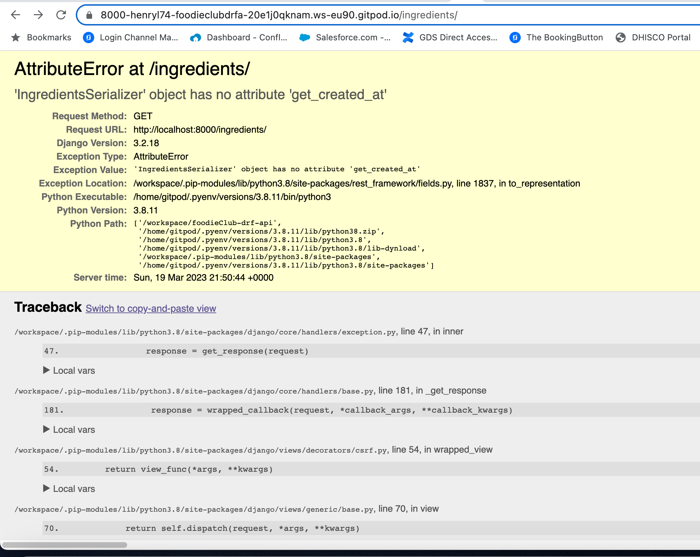

# Testing

## [Back to README.md](../README.md)

## Methodology  
Testing was done throughout the process while developing the project by the use of Django debug pages. In addition all code has been validated with applicable online tools as presented below.

* ## Python Validation

    * All Python code was validated using [CI Python Linter](https://pep8ci.herokuapp.com/) found no errors or warnings except in the settings.py file due "lines too long" which was related to built-in Django code.

`settings.py`

* ## Automated Testings
    * Unit testings was performed in `posts` app.

#### **PostListView Testcase**

#### **PostDetailView Testcase**

#### **Results from the testing**

## URL Testings

- Both the development and deployed versions of each URL have been manually tested by adding all the `/profiles`, `/posts`, `/comments`, `/likes`, `/favorites`, `/followers` and `/ingredients` next to url path one at a time to ensure everything is working.

## CRUD Functionality Testings

- Tested that users can search posts by post title or by the username of the posts owner
- Tested that users can edit or delete their own posts
- Tested that users can lits all their published posts 

## Bugs

- ### Bugs Fixed

  - In the ingredients serializer, I encountered an issue where I was getting `IngredientsSerializer object has no attribute get_created_at` error, this turned out to be an issue due `get_created_at` was not passed in the return.
   
       

  - In the ingredients urls, I encountered an error on the path; this was due a typo error within `'ingredients/<int:pk>/'`
   
       

  - Git push, although this is not a bug, for first time I encountered serious issues pushing updates from one of my sessions, I solved this by following the instructions displayed the in the terminal.

       - Step One

       

       - Step Two

       

* ## Additional Manual Testing

    * In addition to the other tests, I have conducted a manual checklist for myself to make sure that everything is working as intended.

[Back to top](<#testing>)